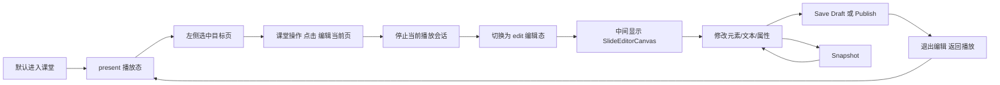
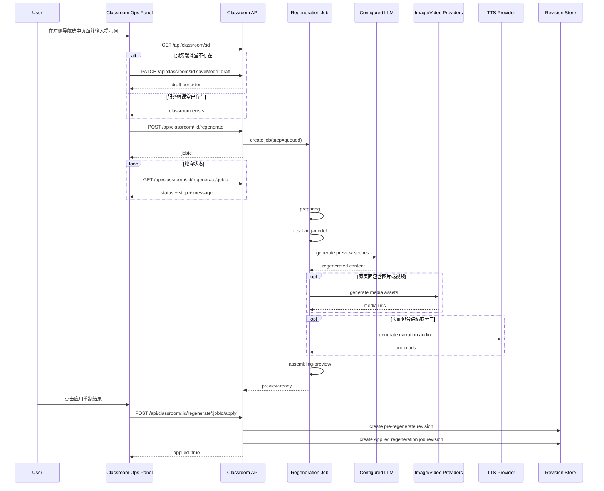
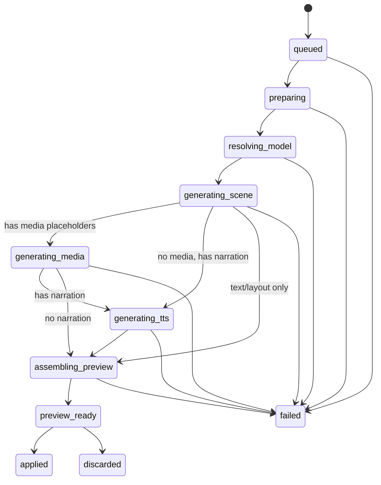

# OpenMAIC v0.2 详细设计方案

## 1. 目标

`v0.2` 详细设计覆盖两项能力：

1. 课程导入导出
2. 生成课件后的人工介入修改

设计目标：

1. 基于 `v0.1` 当前 `Stage/Scene` 数据模型扩展
2. 不破坏现有生成、播放、PPT 导出链路
3. 支持单课程完整迁移
4. 支持“直接编辑”和“对话重制”两种人工修改路径
5. 支持单人编辑闭环和版本恢复

## 2. 当前基线

当前系统已经具备：

1. 课程持久化
   - 服务端文件：`data/classrooms/<id>.json`
   - 前端本地缓存：IndexedDB `stages/scenes/mediaFiles`
2. 课程生成
   - outline 生成
   - scene content 生成
   - 后台任务生成 `generate-classroom`
3. 导出能力
   - PPTX 导出
   - 资源包导出
   - `context.json` 导出
4. 知识库与记忆接入

当前缺口：

1. 没有标准课程包格式
2. 没有课程导入链路
3. 没有正式的草稿态和版本快照
4. 没有对话式重制入口和覆盖策略模型
5. 编辑保存仍偏“直接覆盖”，缺少可恢复性

## 3. 总体设计

### 3.1 架构原则

1. 课程包采用“结构化元数据 + 媒体文件 + manifest”的单文件压缩格式
2. 导入导出走后台任务，避免大文件阻塞请求
3. 编辑采用“当前草稿 + 版本快照”双层模型
4. 服务端持久化是真值来源，前端本地仅用于编辑缓存和加速恢复

### 3.2 设计结果

`v0.2` 引入 4 个新层次：

1. 课程包模型
2. 导入导出任务模型
3. 草稿态模型
4. 历史版本模型
5. 对话重制任务模型

## 4. 课程包格式设计

### 4.1 文件格式

课程包采用：

- `.omaic-course.zip`

内部结构建议：

```text
manifest.json
stage.json
scenes.json
context.json
assets/
  media/
  posters/
  whiteboards/
checksums.json
```

### 4.2 `manifest.json`

字段：

1. `format`: 固定 `openmaic-course`
2. `version`: 例如 `2`
3. `exportedAt`
4. `sourceAppVersion`
5. `courseId`
6. `courseName`
7. `sceneCount`
8. `assetCount`
9. `includesAssets`
10. `hashAlgorithm`

### 4.3 `stage.json`

保存课程级元数据：

1. `id`
2. `name`
3. `description`
4. `language`
5. `style`
6. `generationContext`
7. `agentIds`
8. `createdAt`
9. `updatedAt`

### 4.4 `scenes.json`

保存页面结构：

1. `id`
2. `stageId`
3. `type`
4. `title`
5. `order`
6. `content`
7. `actions`
8. `generationContext`
9. `whiteboards`
10. `createdAt`
11. `updatedAt`

### 4.5 `context.json`

复用并扩展当前导出上下文结构：

1. 课程摘要
2. 页面清单
3. 页面级上下文
4. 知识库资产引用
5. 导出版本信息

### 4.6 `assets/`

资源目录保存：

1. 页面内实际使用的图片、视频、音频
2. 知识库视频封面
3. 交互页静态资源

规则：

1. 所有资源在 `manifest` 中登记
2. 所有资源按相对路径引用
3. 课程导入后重建本地资源映射

## 5. 导出设计

### 5.1 导出入口

新增入口：

1. 课堂页 `Export Course`
2. 首页课程列表 `Export`

### 5.2 导出模式

支持两种模式：

1. `structure-only`
   - 仅导出 `manifest/stage/scenes/context`
   - 不导出媒体资源
2. `full-package`
   - 导出结构和资源

### 5.3 导出流程

1. 前端发起导出请求
2. 服务端创建导出任务
3. 读取课堂 JSON
4. 收集页面资源引用
5. 写出标准压缩包
6. 返回下载地址或二进制流

### 5.4 资源收集规则

需要识别并收集：

1. 普通媒体元素
2. 生成媒体占位符的实际文件
3. `knowledge://fileId` 引用对应的文件与 poster
4. interactive 页面依赖文件

## 6. 导入设计

### 6.1 导入入口

新增入口：

1. 首页课程列表 `Import Course`
2. 后续课程管理页中的课程导入入口

### 6.2 导入流程

1. 上传压缩包
2. 创建导入任务
3. 解压到临时目录
4. 校验 `manifest/version/checksums`
5. 解析 `stage/scenes/context`
6. 复制资源到目标目录
7. 重写课程 `id` 和内部资源引用
8. 写入 `data/classrooms/<newId>.json`
9. 返回新课程地址

### 6.3 冲突策略

`v0.2` 默认采用“导入为新课程”：

1. 不覆盖现有课程
2. 为导入课程分配新 `id`
3. 在 `stage.importSource` 中记录来源信息

### 6.4 导入校验

必须校验：

1. `manifest.format`
2. `manifest.version`
3. `stage.json`
4. `scenes.json`
5. 资源文件存在性
6. 校验和一致性

## 7. 人工修改设计

### 7.1 修改模式

`v0.2` 明确支持两种方式：

1. 直接编辑
   - 用户直接修改当前课程内容
2. 对话重制
   - 用户通过对话提示词描述目标，由模型重新制作部分或全部课件

两条路径共享：

1. 草稿态
2. 版本快照
3. 最终保存发布

### 7.2 编辑对象

允许编辑：

1. 课程元信息
2. 页面标题、顺序、类型元数据
3. slide 画布元素
4. quiz / interactive / pbl 内容
5. actions 和讲稿
6. 页面级上下文备注

### 7.3 编辑状态模型

引入三个状态：

1. `persisted`
   - 最近一次服务端保存结果
2. `draft`
   - 当前编辑中的草稿
3. `revision`
   - 保存后的历史快照

补充一个任务态：

4. `regenerationJob`
   - 对话重制中的后台任务

### 7.4 自动保存策略

自动保存分两层：

1. 本地自动保存
   - 每次编辑后延迟写 IndexedDB
2. 服务端自动保存
   - 间隔提交或显式保存时写课堂 JSON

默认策略：

1. 前端 3 秒防抖保存草稿
2. 关键操作立即保存
   - 删除页面
   - 恢复版本
   - 导入后首次落盘
3. 对话重制结果默认先保存到草稿，不直接覆盖正式版本

### 7.5 直接编辑边界

`v0.2` 只做单人编辑，不做实时协作。

冲突处理策略：

1. 同一浏览器会话内以后写为准
2. 如果服务端版本号已变化，前端保存时提示“需刷新或另存副本”

### 7.5.1 直接编辑入口问题

当前课堂页的中间主区域默认承载“播放 / 讲解”能力，用户看到的是课程播放按钮和讲解控制，不具备直接编辑可操作性。

这会带来两个问题：

1. 用户已在左侧选中目标页面，但无法判断“编辑入口”到底在哪里
2. 如果直接在当前播放画布上叠加编辑交互，会干扰现有的讲解、播放、暂停、翻页等课堂行为

因此 `v0.2` 的直接编辑方案必须遵循：

1. 不改掉原有播放讲解链路
2. 不让播放态和编辑态共享同一套交互热区
3. 必须给出显式、可理解的“进入编辑”与“返回播放”入口

### 7.5.2 双工作区模式

课堂页主区域拆成两种互斥模式：

1. `present`
   - 默认模式
   - 保持当前课程播放、讲解、暂停、继续、翻页、讨论等能力不变
2. `edit`
   - 手动编辑模式
   - 中间主区域切换为当前页编辑画布，不再显示播放讲解按钮

模式切换原则：

1. 默认进入课堂时仍为 `present`
2. 用户只能通过显式入口进入 `edit`
3. `present` 和 `edit` 不能同时对中间画布生效
4. 从 `edit` 返回 `present` 后，应恢复原有课堂播放体验，而不是进入新的页面结构

建议新增前端状态：

1. `workspaceMode: 'present' | 'edit'`
2. `editingSceneId?: string | null`
3. `editorDirty: boolean`
4. `editorSelection?: { elementId?: string; panel?: string }`

### 7.5.3 编辑入口与退出入口

推荐入口放在两个位置，但只维护一套状态：

1. `课堂操作` 页签顶部增加 `编辑当前页` 主按钮
   - 仅当左侧已选中有效页面时可点击
   - 点击后进入 `edit`
2. 课堂顶部工具栏增加 `返回播放` / `结束编辑` 次入口
   - 仅在 `edit` 模式显示

推荐文案：

1. `编辑当前页`
2. `返回播放`
3. `正在编辑：第 N 页 - <title>`

交互约束：

1. 若当前页不存在，则 `编辑当前页` 按钮禁用
2. 若当前页已有未保存改动，切换页面或退出编辑时需提示保存、放弃或取消
3. 若正在播放讲解，点击 `编辑当前页` 时先终止当前播放会话，再进入编辑态
4. `课堂操作` 仍保留保存、快照、导出、重制能力，但不直接承载主画布编辑控件

### 7.5.4 编辑态布局

编辑态保持三栏结构不变，只切换中间主区域的内容：

1. 左侧：幻灯片导航
   - 保持可见
   - 仍是当前编辑页的唯一选择来源
2. 中间：编辑画布
   - 替换原播放讲解主画布
   - 显示当前页的可编辑元素与编辑辅助框
3. 右侧：`课堂操作 / 笔记 / 对话`
   - 继续保留
   - `课堂操作` 中显示当前编辑页状态、保存入口与返回播放入口

编辑态中间区域建议拆成两层：

1. `SlideEditorCanvas`
   - 负责元素选中、拖拽、缩放、重排、对齐辅助线
2. `InspectorPanel`
   - 负责属性编辑
   - 可放在中间画布右侧内嵌区域，或复用右侧栏中的特定子区块

### 7.5.5 不同页面类型的编辑策略

`slide` 页面：

1. 支持选中文本、图片、视频、形状、白板引用等元素
2. 支持拖拽位置、调整尺寸、修改层级
3. 支持双击文本进入行内编辑
4. 支持替换图片/视频资源

`quiz / interactive / pbl` 页面：

1. 不强制做自由画布编辑
2. 采用结构化表单编辑
3. 在中间主区域显示当前页预览，在侧边属性区修改题干、选项、步骤、提示文案、互动配置

`actions / 讲稿 / 页面备注`：

1. 作为当前页编辑的一部分，在编辑态中提供折叠面板
2. 不与播放态中的讲解控制复用同一组件

### 7.5.6 编辑态与播放态的切换规则

从 `present -> edit`：

1. 记录当前 `currentSceneId`
2. 停止当前讲解、语音播报、讨论或自动播放流程
3. 切换主区域为编辑画布
4. 将 `editingSceneId` 设为当前页
5. 高亮顶部“正在编辑”状态条

从 `edit -> present`：

1. 若存在未保存改动，弹出确认
2. 保留当前 `currentSceneId`
3. 销毁编辑态选中框、拖拽状态和属性面板上下文
4. 恢复原播放主画布与播放讲解控制
5. 不自动开始讲解，由用户自行点击播放

### 7.5.7 与左侧导航联动

左侧导航仍然是当前编辑页的唯一来源。

规则：

1. 在 `edit` 模式切换左侧页面时，主画布切换为新页面编辑内容
2. 若当前页有未保存改动，先弹出确认框
3. `课堂操作` 中的“当前作用页面”与编辑态顶部状态条同步更新
4. 后续 `重制当前页` 默认作用于当前左侧选中页，而不是独立的编辑页副本

### 7.5.8 保存与版本策略

直接编辑仍复用现有保存链路，但增加编辑态语义：

1. 编辑态中的变更实时写入前端 store
2. 前端继续防抖写 IndexedDB
3. 用户通过 `Save Draft` / `Publish` 显式提交到服务端
4. 用户可在进入大改前先手动创建 `Snapshot`
5. 恢复历史版本后，若重新进入编辑态，应以恢复后的内容为准

推荐额外补充：

1. 编辑态顶部显示 `Unsaved changes`
2. 保存成功后显示最近保存时间
3. 切换页面、退出编辑、恢复版本前都检查 `editorDirty`

### 7.5.9 前端组件拆分建议

建议新增或调整：

1. `ClassroomWorkspaceShell`
   - 统一管理 `present / edit` 模式
2. `EditCurrentSceneButton`
   - 放在 `课堂操作` 内
3. `SlideEditorCanvas`
   - 画布编辑容器
4. `SceneInspector`
   - 当前页属性面板
5. `EditModeBanner`
   - 显示“正在编辑第 N 页”与“返回播放”

现有组件分工：

1. `Stage`
   - 继续承载播放讲解能力
2. `SceneSidebar`
   - 继续作为当前页来源
3. `ClassroomOpsPanel`
   - 增加进入/退出编辑的操作入口和保存态展示

### 7.5.10 编辑态流程图



### 7.6 对话重制设计

#### 7.6.1 入口

课堂页通过统一的 `课堂操作` 入口承载保存、快照、导出和 `Rework with Prompt` 能力。

入口形态：

1. 位于右侧栏，与 `笔记`、`对话` 作为同级 tab 切换
2. 切换后在右侧栏内展示操作内容，不再额外弹出独立面板
3. 默认不抢占课堂主画布区域
4. 切换后不能覆盖左侧页面导航区域

在该入口内支持：

1. 页面级重制
2. 整课重制
3. 当前选中元素局部重制

#### 7.6.2 当前作用对象与左侧导航联动

`课堂操作` 内的“当前页”不是独立状态，而是直接复用课堂主 store 中的 `currentSceneId`。

联动原则：

1. 左侧导航点击页面时，`SceneSidebar` 更新 `currentSceneId`
2. `课堂操作` 面板订阅同一个 `currentSceneId`
3. 面板内展示当前作用页面卡片：
   - 页面序号
   - 页面标题
   - 页面类型
   - 是否存在预览变更
4. 点击 `重制当前页` 时，始终以当前 `currentSceneId` 组装 `targetType=scene` 与 `targetId`
5. 如果用户在任务创建后切换页面，不影响已经提交任务的目标页，任务以提交瞬间快照为准

交互约束：

1. 未选中页面时，`重制当前页` 按钮禁用
2. 页面切换后，当前作用页面卡片立即刷新
3. 如果当前页面已存在重制预览，面板内需显示“当前页存在预览结果”的提示

#### 7.6.3 创建任务前的服务端真值校验

当前 `POST /api/classroom/:id/regenerate` 依赖服务端课堂文件作为真值来源。

因此在前端发起“重制当前页”或“重制整门课”前，必须增加一层前置校验：

1. 先确认 `/api/classroom/:id` 可读
2. 如果服务端课堂不存在，但前端本地 store 中已有 `stage/scenes`
   - 先执行一次 `PATCH /api/classroom/:id`
   - 使用当前本地 `stage/scenes`
   - `saveMode='draft'`
3. 草稿保存成功后，再继续创建重制任务
4. 若草稿保存失败，直接中断创建任务，并提示“请先保存课堂后再重试”

该设计解决的问题：

1. 课堂仅存在 IndexedDB、本地已可编辑，但服务端尚未落盘时，直接重制会命中 `Classroom not found`
2. 将“生成后的立即人工介入”和“服务端真值驱动的重制任务”串成一条连续链路

前端状态机：

1. `idle`
2. `checking-server-classroom`
3. `saving-draft-before-regenerate`
4. `creating-regeneration-job`
5. `polling-preview`
6. `preview-ready`
7. `failed`

#### 7.6.4 请求结构

对话重制请求需要包含：

1. `classroomId`
2. `target`
   - `course`
   - `scene`
   - `elements`
3. `targetIds`
4. `prompt`
5. `rewriteMode`
   - `text-only`
   - `layout-only`
   - `media-only`
   - `full`
6. `preserveManualEdits`
7. `context`
   - 当前课程摘要
   - 选中页面内容
   - 相关知识库/记忆摘要

针对“重制当前页”的补充约束：

1. `targetType='scene'`
2. `targetId` 必须来自当前 `currentSceneId`
3. 前端创建任务时应同步记录：
   - `sceneTitle`
   - `sceneOrder`
   - 提交时间
4. 这些附加信息主要用于 UI 展示和任务关联，不改变服务端以 `targetId` 为准的原则

#### 7.6.5 执行流程

1. 用户在左侧导航选中目标页面
2. `课堂操作` 面板显示当前作用页面
3. 用户输入提示词
4. 前端检查课堂服务端真值是否存在
5. 如不存在，则先自动保存当前草稿
6. 前端发送重制请求
7. 服务端创建重制任务
8. 服务端根据当前 provider 配置解析本次重制使用的默认 LLM
9. LLM 先根据范围生成新的 `stage/scene/element` 草稿结果
10. 若目标页原本存在图片或视频元素，服务端继续组装媒体生成请求，并调用已配置可用的图片/视频模型补齐预览资源
11. 若目标页包含讲稿或旁白，服务端继续调用已配置可用的 TTS 模型补齐预览音频
12. 服务端按阶段写入任务进度：`preparing`、`resolving-model`、`generating-scene`、`generating-media`、`generating-tts`、`assembling-preview`
13. 前端轮询任务状态，并在 `课堂操作` 中显示加载动画、进度条和当前阶段文案
14. 返回 diff 摘要或草稿版本
15. 用户确认后应用到当前草稿

重制阶段的多媒体补齐需要遵循统一实现约束：

1. 图片、视频、TTS 不允许各自维护独立的“重制专用” provider 调用分支
2. 重制阶段必须复用与常规生成阶段一致的服务端 helper
3. 图片生成前需先将 `aspectRatio` 归一化为明确的 `width/height`
4. 视频生成前需先按 provider 能力归一化 `duration / aspectRatio / resolution`
5. TTS 文件扩展名必须以真实返回格式为准，而不是以 provider 默认支持格式硬编码
6. 图片、视频、TTS 的生成日志应分别统一为：
   - `Generating image: provider=..., model=..., prompt=..., size=...`
   - `Generating video: provider=..., model=..., prompt=..., duration=..., aspect=..., resolution=...`
   - `Generating TTS: provider=..., voice=..., audioId=..., textLen=...`
7. 重制阶段的日志标签允许不同于普通接口标签，但日志内容字段必须保持一致，便于联调和排障

重制当前页时序图：



### 7.6.1 公式渲染告警收敛

当前课程生成和白板动作都会在服务端将 LaTeX 公式渲染为 KaTeX HTML。

已知问题：

1. 当 display math 中出现 `\\` 或 `\newline` 时，KaTeX 会输出 `newLineInDisplayMode`
2. 该问题通常不影响页面实际渲染，但会在服务端日志中重复刷屏
3. 若不收敛，会干扰重制链路和课堂回放链路的真实错误排查

`v0.2` 需要采用统一渲染 helper：

1. 课程生成阶段的公式元素渲染与白板 `wb_draw_latex` 必须共用同一 helper
2. 统一使用 `displayMode: true`
3. 仅对 `newLineInDisplayMode` 这类已知兼容性 strict code 做忽略处理
4. 其他 KaTeX 渲染问题仍保持 `warn` 或错误日志，不允许整体关闭严格模式

这样可以保证：

1. 页面公式与白板公式渲染行为一致
2. 兼容旧数据中已存在的 `\\` 写法
3. 不因可忽略告警污染部署与重制任务日志

重制任务阶段状态图：



#### 7.6.6 覆盖策略

支持两类策略：

1. `preserve`
   - 保留人工修改部分，只替换指定范围
2. `replace`
   - 用新结果覆盖指定范围

覆盖粒度：

1. 课程级
2. 页面级
3. 元素级

#### 7.6.7 结果应用

对话重制结果不直接写正式版本。

统一策略：

1. 先生成草稿
2. 用户预览
3. 应用前先创建一份 `pre-regenerate` 快照，作为恢复点
4. 应用成功后再额外创建一份 `Applied regeneration job <jobId>` 的系统版本
5. 当前 `stage.revisionId` 指向最新已应用重制版本
6. 用户可恢复旧版本，也可再次恢复到某次已应用的重制结果
7. 用户仍可选择丢弃本次预览，且不影响历史版本链

历史版本与重制结果回切图：


## 8. 版本快照设计

### 8.1 版本模型

每次显式保存可生成版本快照。

字段：

1. `revisionId`
2. `classroomId`
3. `baseVersion`
4. `summary`
5. `createdAt`
6. `createdBy`
7. `snapshotPath`

### 8.2 快照策略

`v0.2` 采用完整快照，不做增量 diff 存储。

原因：

1. 实现简单
2. 恢复可靠
3. 当前单课程数据量可控

### 8.3 恢复策略

恢复版本时：

1. 读取快照
2. 覆盖当前课堂持久化文件
3. 生成新的恢复版本记录
4. 刷新前端编辑状态

## 9. 数据结构扩展

### 9.1 `Stage`

建议新增字段：

1. `version?: number`
2. `lastSavedAt?: number`
3. `lastEditedAt?: number`
4. `importSource?:`
   - `packageVersion`
   - `sourceCourseId`
   - `importedAt`
5. `draftStatus?: 'clean' | 'dirty' | 'regenerating'`

### 9.2 `Scene`

建议新增字段：

1. `lastEditedAt?: number`
2. `editedByUser?: boolean`
3. `manualNotes?: string`
4. `manualEditFlags?:`
   - `contentEdited`
   - `actionsEdited`
   - `layoutEdited`

### 9.3 新增重制任务模型

建议新增：

1. `classroom_regeneration_jobs`
   - `id`
   - `classroom_id`
   - `target_type`
   - `target_ids_json`
   - `prompt`
   - `rewrite_mode`
   - `preserve_manual_edits`
   - `status`
   - `result_snapshot_path`
   - `created_at`
   - `updated_at`

### 9.4 新增服务端目录

建议新增：

```text
data/
  classrooms/
  classroom-jobs/
  classroom-regeneration-jobs/
  classroom-revisions/
  classroom-imports/
  classroom-exports/
```

## 10. API 设计

### 10.1 课程导出

1. `POST /api/classroom/export`
   - 请求：
     - `classroomId`
     - `mode`
   - 返回：
     - `jobId`
     - `status`
2. `GET /api/classroom/export/:jobId`
   - 返回任务状态和下载地址

### 10.2 课程导入

1. `POST /api/classroom/import`
   - `multipart/form-data`
   - 字段：
     - `file`
     - `importMode`
2. `GET /api/classroom/import/:jobId`
   - 返回导入状态和新课程 `id`

### 10.3 课程编辑保存

1. `PATCH /api/classroom/:id`
   - 保存课程元信息或页面结构变更
2. `POST /api/classroom/:id/save-draft`
   - 持久化草稿
3. `POST /api/classroom/:id/publish`
   - 生成稳定版本

### 10.4 对话重制

1. `POST /api/classroom/:id/regenerate`
   - 创建重制任务
2. `GET /api/classroom/:id/regenerate/:jobId`
   - 查询重制任务状态
3. `POST /api/classroom/:id/regenerate/:jobId/apply`
   - 将重制结果应用到当前草稿
4. `POST /api/classroom/:id/regenerate/:jobId/discard`
   - 丢弃本次重制结果

### 10.5 历史版本

1. `GET /api/classroom/:id/revisions`
2. `POST /api/classroom/:id/revisions`
3. `POST /api/classroom/:id/revisions/:revisionId/restore`

## 11. 前端设计

### 11.1 首页

新增：

1. `Import Course`
2. 课程卡片 `Export Course`
3. 草稿/已保存状态标记

### 11.2 课堂页

新增：

1. `课堂操作` 页签
2. 与 `笔记`、`对话` 同级的右侧栏切换组
3. `Save Draft`
4. `Revision History`
5. `Export Course`
6. `Rework with Prompt`
7. 重制结果预览与应用按钮
8. 当前作用页面联动卡片

布局约束：

1. 切换到 `课堂操作` 时，左侧页面导航保持可见
2. 课堂主画布与左侧导航不因 `课堂操作` 页签而被固定遮挡

联动约束：

1. 左侧页面导航是“重制当前页”的唯一页面选择来源
2. `课堂操作` 不再维护第二套独立页面选择状态
3. 当前作用页面信息需在右侧栏内始终可见

### 11.3 编辑器行为

编辑器需要支持：

1. 当前页面直接编辑
2. 页面列表插入、复制、删除、拖拽排序
3. 顶部保存状态提示
4. 版本恢复后整页刷新
5. 对话窗口持续追问修改
6. 重制影响范围与覆盖策略确认

## 12. 存储设计

### 12.1 服务端真值

服务端课堂 JSON 仍是主真值：

1. 导入后直接写服务端
2. 手工保存后直接写服务端
3. 导出从服务端真值读取

### 12.2 前端缓存

IndexedDB 用于：

1. 编辑中恢复
2. 临时草稿
3. 本地媒体预览映射

## 13. 错误处理

### 13.1 导入错误码

建议新增：

1. `CLASSROOM_IMPORT_INVALID_PACKAGE`
2. `CLASSROOM_IMPORT_VERSION_UNSUPPORTED`
3. `CLASSROOM_IMPORT_ASSET_MISSING`
4. `CLASSROOM_IMPORT_CHECKSUM_FAILED`

### 13.2 导出错误码

建议新增：

1. `CLASSROOM_EXPORT_NOT_FOUND`
2. `CLASSROOM_EXPORT_ASSET_READ_FAILED`
3. `CLASSROOM_EXPORT_PACKAGE_BUILD_FAILED`

### 13.3 编辑与重制错误码

建议新增：

1. `CLASSROOM_SAVE_CONFLICT`
2. `CLASSROOM_REVISION_NOT_FOUND`
3. `CLASSROOM_REGENERATE_INVALID_TARGET`
4. `CLASSROOM_REGENERATE_APPLY_FAILED`

## 14. 兼容性策略

### 14.1 对 `v0.1` 课堂数据

保持兼容：

1. 老课堂没有 `revision/version/importSource` 字段时按默认值处理
2. 旧课堂可以直接进入编辑模式
3. 旧课堂可直接导出 `v0.2` 课程包

### 14.2 对未来版本

课程包设计必须保证：

1. `manifest.version` 可升级
2. 资源相对路径可迁移
3. `context.json` 可扩展字段但不破坏旧解析

## 15. 安全与约束

1. 导入 ZIP 时禁止路径穿越
2. 资源写入前做目标目录白名单校验
3. 导入时禁止覆盖已有课堂文件
4. 版本恢复必须先做目标存在性检查

## 16. 实施步骤

### 阶段 1

1. 定义课程包格式
2. 实现导出任务和压缩包写出
3. 实现导入任务和临时解压校验

### 阶段 2

1. 实现课程草稿保存
2. 实现课堂页编辑入口
3. 实现对话重制任务
4. 实现版本快照

### 阶段 3

1. 实现课程列表导入导出入口
2. 实现版本恢复
3. 实现对话重制结果预览与应用
4. 实现导入冲突提示和错误展示

## 17. 验收建议

### 核心验证场景

1. 生成一门课程后导出，再导入，确认课程可播放、可导出 PPT
2. 编辑 slide 文本与页面顺序后保存，刷新后确认结果保留
3. 通过提示词对单页进行重制，确认结果先进入草稿态，再由用户确认应用
4. 创建版本快照，修改课程，再恢复旧版本，确认内容可回退
5. 导入缺少资源文件的损坏包，确认返回明确错误

## 18. 结论

`v0.2` 的核心不是继续扩展生成能力，而是把“生成结果”变成“可迁移、可编辑、可重制、可恢复”的课程资产。

这两个能力上线后，OpenMAIC 的课程工作流才算完整：

1. 生成
2. 编辑
3. 对话重制
4. 保存
5. 导出
6. 导入
7. 恢复
